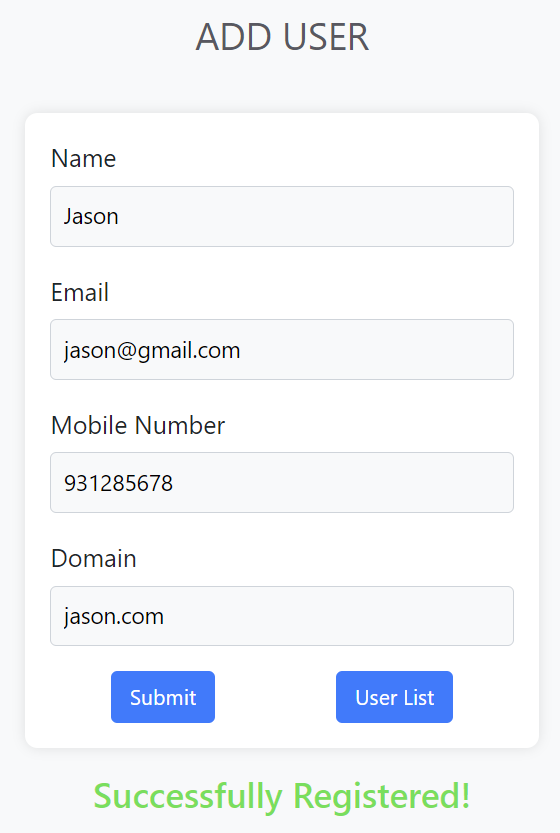
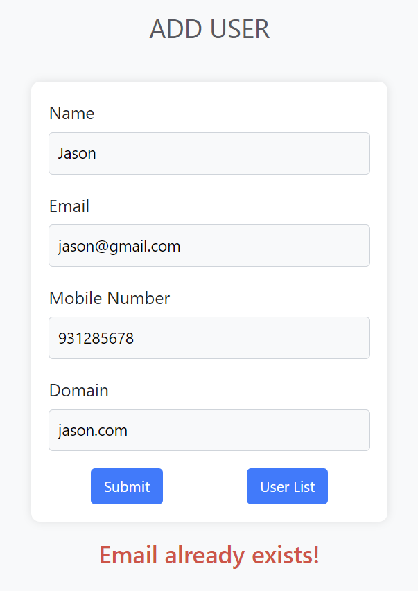
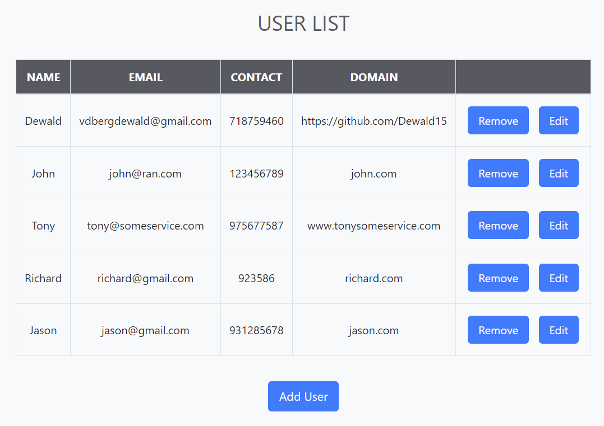
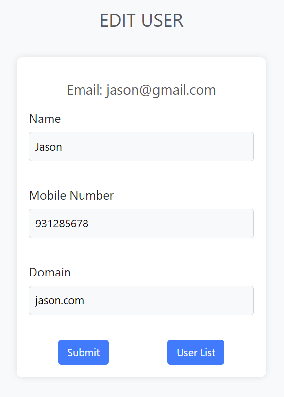
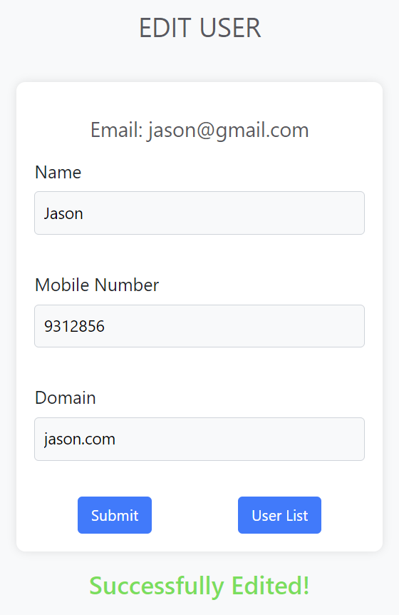

# User Management System Documentation

## Introduction

Welcome to the User Management System documentation! This document serves as a guide to understand the architecture, functionality, and usage of the User Management System implemented in Java.

### Overview

The User Management System is a web-based application developed using Java, Maven as the build tool, and Tomcat as the server. It leverages JDBC for CRUD operations (Create, Read, Update, Delete) on user data stored in a database. The application is built following the Model-View-Controller (MVC) architecture, where JavaServer Pages (JSPs) act as the view layer, controllers (servlets) as the controller layer, and models and services handle the business logic and communication with the database.

### Purpose

The primary purpose of the User Management System is to provide a platform for managing user data efficiently. It allows users to perform CRUD operations on user records to create, retrieve, update, and delete user information as needed.

### Features

- **User CRUD Operations:** Perform Create, Read, Update, and Delete operations on user records.
- **User Interface:** Provide a user-friendly interface using JSPs for seamless interaction with the system.
- **Scalability:** Designed to be scalable to accommodate a growing number of users and data.
- **Reliability:** Ensure reliability in data storage and retrieval through robust database operations.

## Getting Started

To get started with the User Management System, follow these steps:

1. **Prerequisites:** Ensure you have Java Development Kit (JDK), Apache Maven, and Apache Tomcat installed on your system.

2. **Clone the Repository:** Clone the User Management System repository from https://github.com/Dewald15/UserManagementSystem.git.

3. **Database Setup:**    The application uses MySQL database. Create a schema with the following queries:
```sql
create database uuu;
use uuu;
create table user
(name varchar(50), email varchar(50), mobile int(10), domain varchar(50));
```

- In `utils/ConnectionProvider.java`, update the 'username' and 'password' variable values to match your newly created database credentials.
```java
String username = "yourUsername";
String password = "yourPassword";
```

4. **Build the Project:** Use Maven to build the project and resolve dependencies.

5. **Deploy to Tomcat:** Deploy the application to Apache Tomcat server.
   - Use Apache Tomcat version 10.1.18.
   - Deployment directory: `UserManagementSystem\src\main\webapp`.
   - Context path: `/UserManagementSystem.src/main/webapp/registration.jsp`.
   - Server port: 8080.
   - Admin port: 8005.

6. **Other Configurations**
   - Mark the 'src' directory as 'Sources Root'

## Usage

Once the User Management System is set up and deployed, users can perform the following actions:

- **Create User:** Add new user records to the system.
- **View User:** Retrieve user information from the database.
- **Update User:** Modify existing user details.
- **Delete User:** Remove user records from the system.

## Contributors

The User Management System project was developed by Dewald van den Berg.
For any queries or support, please contact vdbergdewald@gmail.com.

## Screenshots
<div style="text-align: center;">

### 1. **registration.jsp**


### 2. **registration.jsp - after successful submit**



### 3. **registration.jsp - duplicate email error**



### 4. **userlist.jsp**



### 5. **edit.jsp**



### 6. **edit.jsp - after successful submit**


</div>