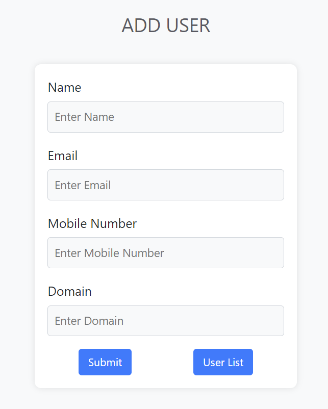
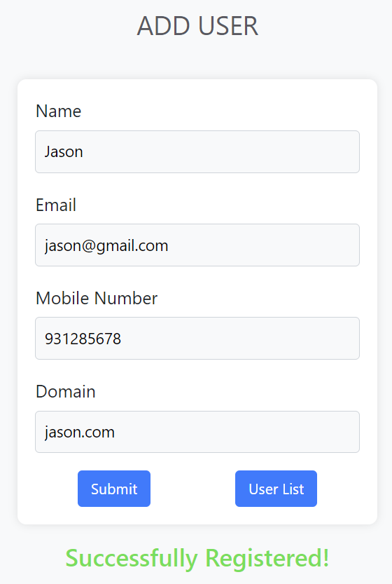
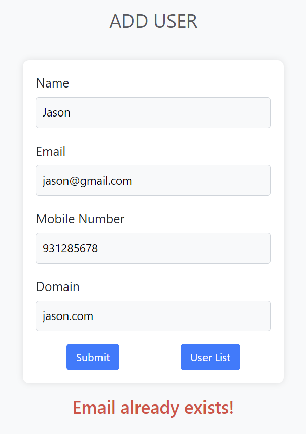
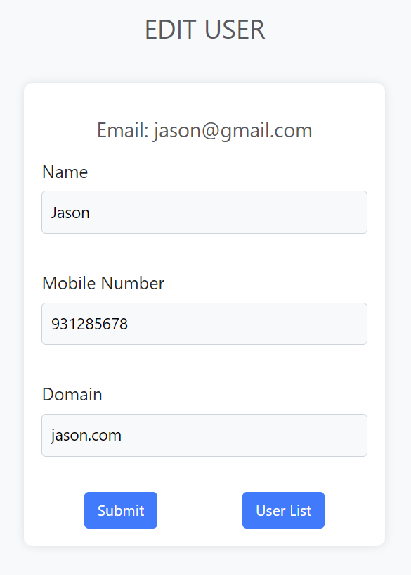
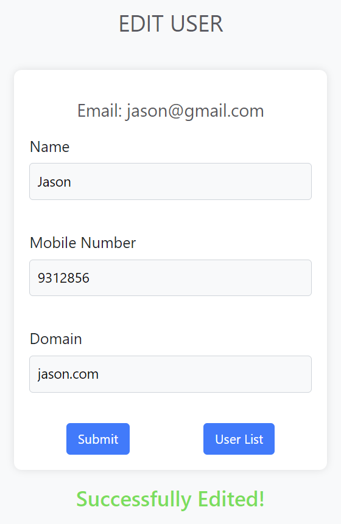

# User Management System

## Introduction

This Java Maven web application runs on a Tomcat server and serves as a fundamental web-based user management system. Leveraging JDBC for CRUD (Create, Read, Update, Delete) operations, the application employs JavaServer Pages (JSPs) to provide an intuitive user interface.

## Project Structure

The core functionality is encapsulated within the 'Project' package, where the `ConnectionProvider.java` file orchestrates the creation of the JDBC driver and Connection object. The web application comprises three main pages:

1. **Add User Page (registration.jsp):**
   - Allows users to register by submitting relevant information.
   - Utilizes `registrationaction.jsp` to process data insertion into the database.
   - Upon completion, redirects to `registration.jsp` with a message parameter indicating the success or failure of the submission.

2. **User List Page (userlist.jsp):**
   - Displays a comprehensive list of all registered users.
   - Enables users to edit or delete existing entries or return to the user registration page.
   - Deletion triggers forwarding to `remove.jsp` with the email as a parameter, facilitating the removal of the user from the database and subsequent redirection to `userlist.jsp`.

3. **Edit Page (edit.jsp):**
   - Allows modification of user information.
   - Submission of changes redirects to `editaction.jsp`, where the user with the specified email is located and updated.
   - After updating, redirects back to `edit.jsp` with all parameters intact to maintain the user's input values.

## Configuration Steps

To set up and run the application, follow these configuration steps:

1. **Run/Debug Configurations:**
   - Use Apache Tomcat version 10.1.18.
   - Catalina base: `user\.SmartTomcat\servletContainerName`.
   - Deployment directory: `UserManagementSystem\src\main\webapp`.
   - Context path: `/UserManagementSystem.src/main/webapp/registration.jsp`.
   - Server port: 8080.
   - Admin port: 8005.

2. **Deployment Directory:**
   - Ensure the deployment directory is set to `UserManagementSystem\src\main\webapp`.

3. **Context Path:**
   - Set the context path to `/UserManagementSystem.src/main/webapp/registration.jsp`.

4. **Server Port:**
   - The application is configured to run on port 8080.

5. **Admin Port:**
   - Admin port is set to 8005.

6. **Dependencies:**

   - Add the MySQL JAR file to the project library. Download `mysql-connector-j-8.3.0`.

      ```xml
      <!-- Example Maven Dependency -->
      <dependency>
          <groupId>mysql</groupId>
          <artifactId>mysql-connector-java</artifactId>
          <version>8.3.0</version>
      </dependency>
      ```

   - The application uses PHPMyAdmin.co to host the MySQL database.

7. **Configuration:**

   - Ensure JDK version 21 is installed.

## Screenshots

### 1. **registration.jsp**



### 2. **registration.jsp - after successful submit**



### 3. **registration.jsp - duplicate email error**



### 4. **userlist.jsp**


### 5. **edit.jsp**



### 6. **edit.jsp - after successful submit**

